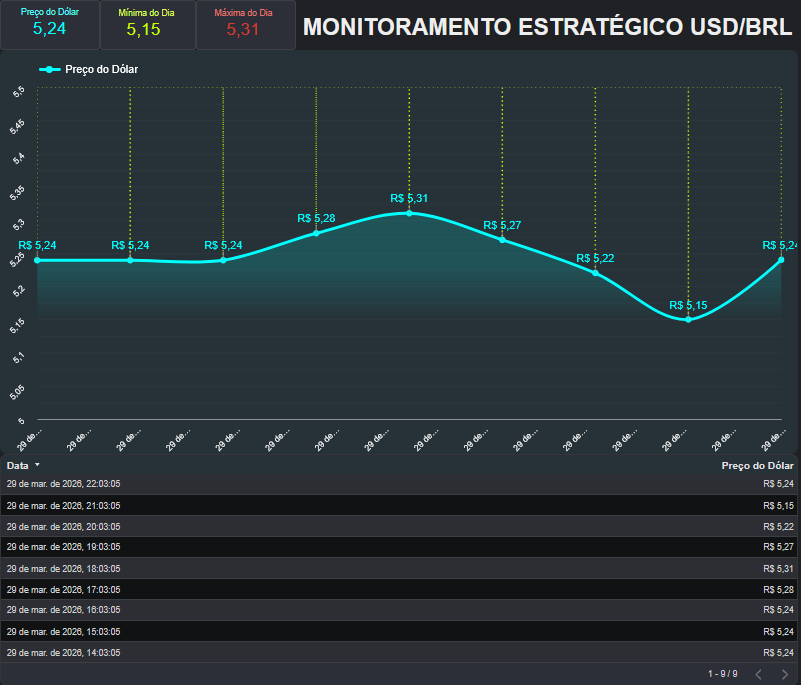

# 📈 Monitor de Câmbio USD/BRL - Real-Time Pipeline

> **Pipeline automatizado de ingestão e visualização de dados financeiros em tempo real.**

 

---

## 📊 Visualização do Dashboard

---

### 📝 Sobre o Projeto

Este projeto consiste em um pipeline de dados automatizado para monitoramento e análise da variação do Dólar Americano em relação ao Real Brasileiro. O objetivo é transformar dados brutos de uma API financeira em insights visuais em tempo real, utilizando uma arquitetura moderna, de baixo custo e alta disponibilidade.

### 🛠️ Tecnologias & Ferramentas

  

* **API de Câmbio:** Fonte primária de dados via requisições JSON.
* **Make (Integromat):** Orquestrador do pipeline, responsável pelo consumo da API e tratamento de dados.
* **Google Sheets:** Atua como a camada de armazenamento (Data Warehouse), mantendo o histórico estruturado.
* **Looker Studio:** Camada de Business Intelligence (BI) para visualização e análise de dados.

### ⚙️ O Pipeline de Dados

1.  **Ingestão:** O **Make** realiza chamadas agendadas para a API de câmbio a cada 15 minutos.
2.  **Tratamento:** Os dados são validados e o fuso horário é ajustado para o padrão brasileiro (UTC-3).
3.  **Carga:** Cada registro é inserido automaticamente em uma linha do **Google Sheets**.
4.  **Visualização:** O **Looker Studio** consome a planilha e atualiza os indicadores instantaneamente.

### 📊 Funcionalidades do Dashboard

* **Indicadores de Extremos:** Cálculo dinâmico de Máxima e Mínima do dia.
* **Análise de Tendência:** Gráfico de série temporal com escala otimizada para identificar a volatilidade do mercado.
* **Visualização Técnica:** Interface em *Dark Mode* com foco em legibilidade e contraste.
* **Tabela de Auditoria:** Histórico detalhado das últimas capturas com formatação zebra para fácil leitura.

### 🚀 Acesso ao Painel

O dashboard é interativo e pode ser acompanhado em tempo real através do link oficial:

---
*Desenvolvido como projeto de automação e análise de dados.*
